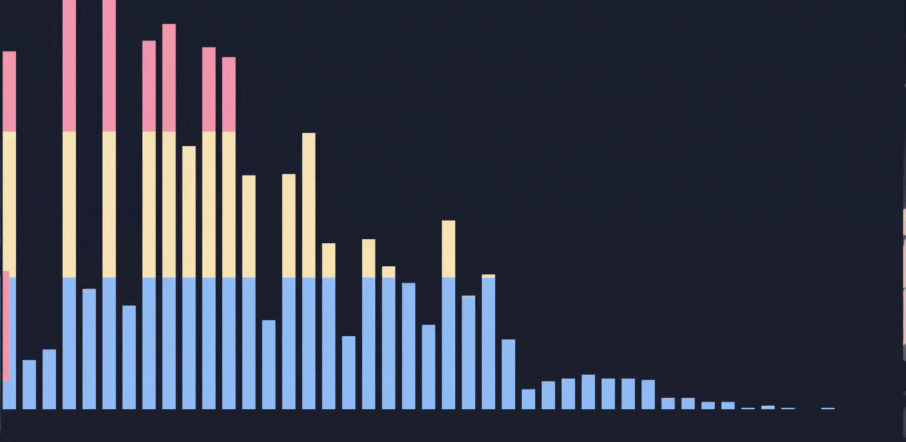

# Spectra-View
A C++ project that analyzes audio by computing the Discrete Fourier Transform (DFT) on short time windows of a WAV file. The FFT magnitudes are then used to visualise the audio in the user's terminal.

## Brief Overview
### What is a Fourier Transform?
The Fourier transform (FT) is an integral transform that takes a function as input, and outputs another function that describes the extent to which various frequencies are present in the original function.

The **Discrete Fourier Transform (DFT)** is a mathematical tool that converts a discrete sequence of data points from the time domain into a corresponding sequence in the frequency domain, breaking down a signal into its fundamental sinusoidal components.

The DFT thus proves useful to extract the frequencies present in digital audio files (like WAV!)

## Features / Roadmap
- [X] Read WAV files and processe raw PCM samples (from scratch)
- [X] Use the Hann windowing function to smoothly transition between moving windows
- [X] Compute the DFT of all samples inside the window
- [X] Draw bars on the terminal to visualise the audio

## Demo
- Visualiser output for a 1000Hz pure sine wave

## Resources
- [Coding Adventure: Sound](https://youtu.be/iA6wRgwl7k0?si=urdCEdR-AZQjt4Xy)
- [But what is a Fourier Transform? A visual introduction](https://youtu.be/spUNpyF58BY?si=UgOr_b3WYAmmJ-nl)
